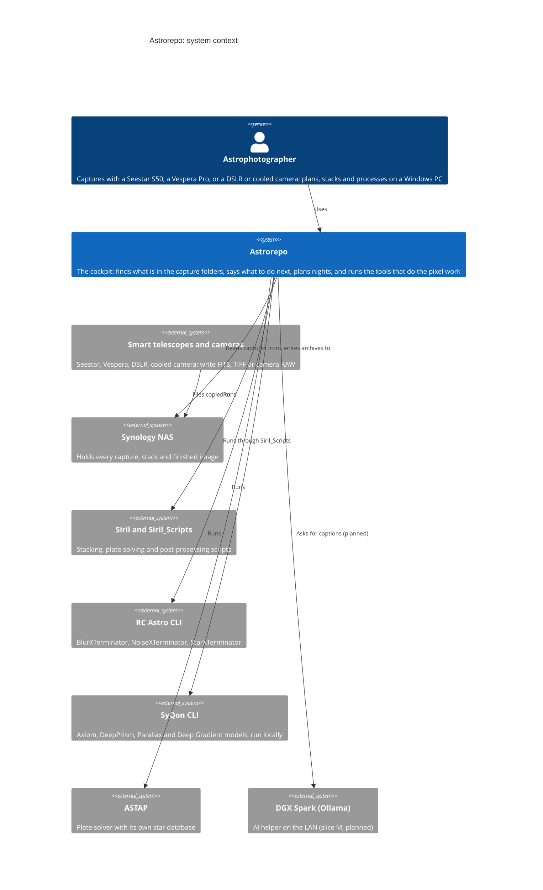
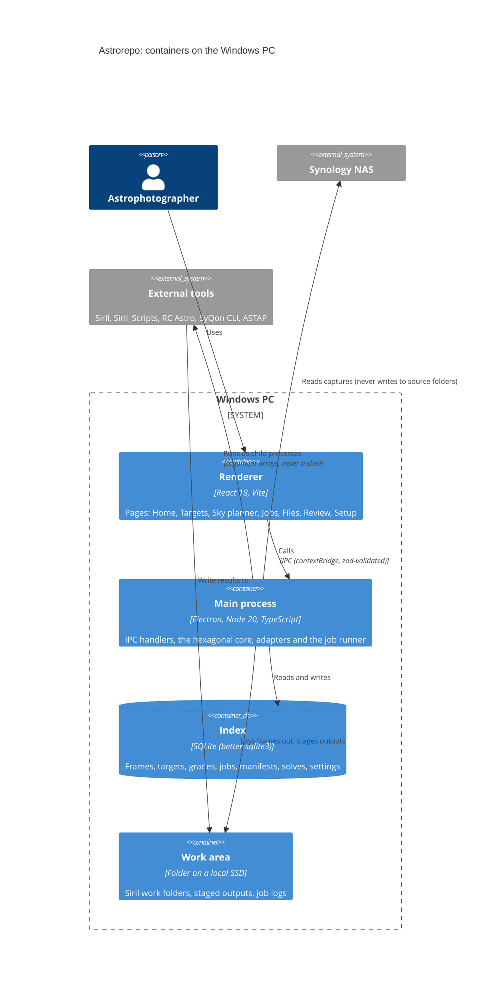
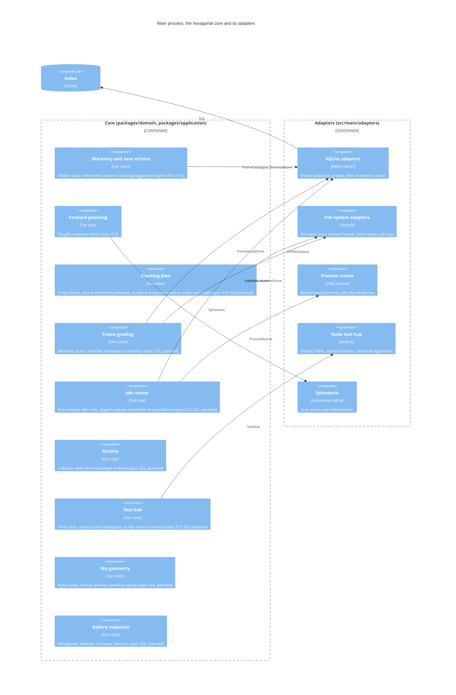

# C4 model

The app drawn at three levels of the [C4 model](https://c4model.com): who and what it talks to
(context), what runs where (containers), and the parts of the hexagonal core inside the desktop
app (components). Every slice that adds a port, an adapter or an external tool updates these
diagrams in the same pull request, so they always match `main`. Parts marked *planned* are in the
roadmap but not built yet.

## Level 1 · System context

## Level 2 · Containers

## Level 3 · Components of the main process

The core is `packages/domain` (pure rules) and `packages/application` (use cases and the ports
they need). Adapters in `src/main/adapters` implement the ports; `src/main/composition.ts` is the
only place they meet. The tool hub is the gateway every external program goes through.

## Keeping the diagrams honest

- A new port appears as a labelled relation in the component diagram, named as the interface is.
- A new external program appears in the context diagram and goes through the tool hub.
- `tests/architecture/hexagon-boundaries.test.ts` enforces the boundaries the component diagram
  draws: the domain imports nothing outside itself and the application imports only the domain.
