# React Component Hierarchy

The renderer is a single-page React 18 application using HashRouter for navigation (required by Electron's `file://` protocol). The top-level `App` component wraps all routes in a persistent `Layout` that provides a collapsible sidebar for navigation and a main content area. Each route renders a page component that composes shared UI primitives. Common components like `PageContainer`, `SearchBar`, `TargetCard`, `WorkflowStepper`, and `SessionList` are reused across pages to keep the interface consistent.

```mermaid
graph TD
    App["App<br/>(HashRouter, ErrorBoundary)"]

    App --> Layout

    Layout --> Sidebar["Sidebar<br/>(navigation links,<br/>active route indicator)"]
    Layout --> Routes["Route Outlet"]

    Routes --> Dashboard["Dashboard<br/>(stats overview,<br/>recent sessions,<br/>tonight's plan)"]
    Routes --> TargetList["TargetList"]
    Routes --> TargetDetail["TargetDetail"]
    Routes --> SessionForm["SessionForm<br/>(create/edit session)"]
    Routes --> Collections["Collections<br/>(list all collections)"]
    Routes --> CollectionDetail["CollectionDetail"]
    Routes --> Equipment["Equipment<br/>(manage gear)"]
    Routes --> Observatory["Observatory<br/>(location settings,<br/>horizon profile)"]
    Routes --> Planning["Planning<br/>(tonight's visibility,<br/>altitude charts)"]
    Routes --> Poster["Poster<br/>(printable target poster)"]
    Routes --> Settings["Settings<br/>(app preferences,<br/>folder templates)"]

    TargetList --> SearchBar_TL["SearchBar<br/>(text + filters)"]
    TargetList --> TargetCard_TL["TargetCard[]<br/>(thumbnail, name,<br/>stage badge, type icon)"]

    TargetDetail --> WorkflowStepper["WorkflowStepper<br/>(stage progression<br/>with transitions)"]
    TargetDetail --> SessionList_TD["SessionList<br/>(linked sessions)"]
    TargetDetail --> SectionField["Section / Field<br/>(coordinates, aliases,<br/>catalogues, notes)"]

    CollectionDetail --> TargetCard_CD["TargetCard[]"]

    subgraph Common["Common / Shared Components"]
        direction LR
        PageContainer["PageContainer<br/>(title, breadcrumbs,<br/>actions slot)"]
        SearchBar["SearchBar"]
        TargetCard["TargetCard"]
        WorkflowStepperC["WorkflowStepper"]
        SessionListC["SessionList"]
    end

    Dashboard -.-> PageContainer
    TargetList -.-> PageContainer
    TargetDetail -.-> PageContainer
    Collections -.-> PageContainer
    CollectionDetail -.-> PageContainer
    Equipment -.-> PageContainer
    Observatory -.-> PageContainer
    Planning -.-> PageContainer
    Settings -.-> PageContainer

    style App fill:#1e293b,stroke:#38bdf8,color:#e2e8f0
    style Layout fill:#1e293b,stroke:#38bdf8,color:#e2e8f0
    style Common fill:#0f172a,stroke:#a78bfa,color:#c4b5fd
    style Sidebar fill:#1e293b,stroke:#64748b,color:#e2e8f0
```

