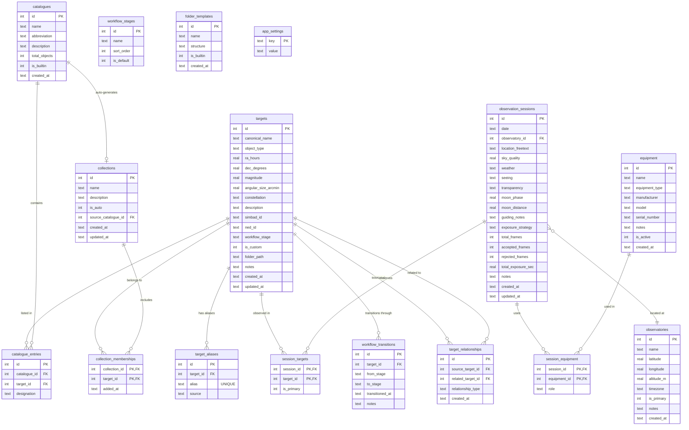

# Data Model

The Astrorepo database contains 16 tables (14 domain tables plus a full-text search virtual table and an app settings key-value store). The schema is centred on **targets** -- the celestial objects an astrophotographer wants to image. Targets are organised into **catalogues** (Messier, NGC, etc.) via catalogue entries, grouped into user or auto-generated **collections**, and linked to **observation sessions** that record imaging runs. Equipment, observatories, and workflow state are tracked as first-class entities. All foreign keys use integer IDs with cascading deletes where appropriate.

