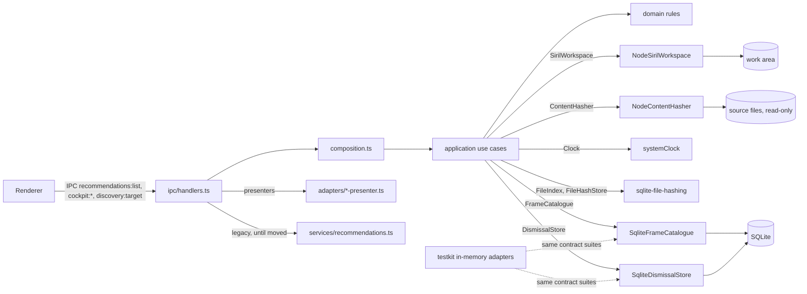

# Hexagonal core and EARS traceability

The C4 diagrams in [c4.md](c4.md) show the same core from the outside in.

This is how the app moves to a hexagonal architecture without a rewrite. The existing Electron app
keeps working; logic moves out of `src/main/services` into a core one use case at a time
(the strangler pattern), and each moved piece is reachable through the same IPC channel as before.

## Layout

```text
packages/
  domain/        entities, value objects and rules. Pure: imports only its own files.
  application/   use cases and the ports (interfaces) they need. Imports only @astro/domain.
  testkit/       in-memory adapters, test data builders and port contract suites. Test-only.
src/main/
  adapters/      driven adapters for the desktop app (SQLite today) and presenters for IPC.
  composition.ts composition root: builds use cases from adapters. The only place they meet.
  ipc/           driving adapter: IPC handlers call use cases from the composition root.
  services/      legacy services, shrinking as logic moves into packages/.
```



## What is in the core today

| Use case | Domain rules | Ports | IPC channel | Spec |
|---|---|---|---|---|
| `listStackingSuggestions` | `assessStackingReadiness`, `isDismissed` | FrameCatalogue, DismissalStore | `recommendations:list` | 009, 010 |
| `dismissSuggestion` | `dataFingerprint` | FrameCatalogue, DismissalStore, Clock | `cockpit:dismiss` | 010 |
| `discoverTargets`, `discoverTarget` | `discoverTarget`, `deriveProgress` | FrameCatalogue | `cockpit:overview`, `discovery:target` | 010 |
| `reportHiddenData` | `reportHiddenData`, `calibrates`, `groupDuplicates` | FrameCatalogue, FileHashStore | `cockpit:overview` | 010, 011 |
| `findDuplicates` | `isHashCurrent`, `duplicateCandidates`, `groupDuplicates` | FileIndex, ContentHasher, FileHashStore | `ingest:find-duplicates` | 011 |
| `prepareSirilWorkspace` | `planSirilWorkspace`, `sirilFolderFor` | SirilWorkspace | `home:prep-siril` | 011 |
| `estimateSirilRun` | `planSirilWorkspace`, `recommendSirilScript`, `estimateSirilSpace`, `spaceVerdict` | SirilWorkspace (`frameDetails`, `workAreaSpace`, `copyBytes`) | `siril:estimate` | 014 |
| `listTools` | `toolWarnings` | ToolHub | `tools:list` | 015 |
| `planPostProcessing` | `buildPostProcessRecipe`, `profileForObjectType`, `formatCoords`, `postProcessingSpace` | StackCatalogue, ToolHub, SirilWorkspace (`stackResults`, `workAreaSpace`, `contains`) | `recipe:post-process` | 015 |
| `queueStack`, `queuePostProcess` | `sirilStackCommand`, `postProcessCommand` | JobStore, ToolHub (`stockScript`), StackCatalogue, Clock (composes `estimateSirilRun` and `planPostProcessing`) | `jobs:queue-stack`, `jobs:queue-post-process` | 016 |
| `makeJobScheduler` (`tick`, `cancel`, `runNow`, `recover`, `log`) | `scheduleJobs`, `windowState`, `estimateJobSeconds`, `afterInterruption` | JobStore, JobSettingsSource, MachineMonitor, ProcessRunner, JobLogs, SirilWorkspace (`workAreaSpace`), Clock | `jobs:list`, `jobs:cancel`, `jobs:run-now`, `jobs:log` | 016 |
| `listNextActions` | `rankNextActions` | (composes `listStackingSuggestions` and `planForward`) | `recommendations:list` | 013 |
| `planForward` | `planTonight`, `seasonClosing`, `monthlySeason`, `newMoonWindows`, `usableHours` | FrameCatalogue, TargetPositions, PlanningSettings, Ephemeris, Clock | `planning:forward` | 012 |

The legacy FITS scan (`services/fits-analyzer.ts`) uses the domain's `planRescan` for its fast
path and writes unreadable files to `quarantined_files`. It is paced by the domain's `restAfter`
through `services/scan-pacer.ts` (spec 018), so it rests between small slices of work and can be
cancelled. Moving the scan itself into the core is the next step for ingest.

The Ephemeris port hands the domain sidereal time and the moon for each half hour of a night's dark
window, so altitude, separation and every planning rule are plain trigonometry in the domain. The
astronomy-engine adapter is the only code that knows about the sun and moon, and the testkit's
`FakeEphemeris` uses real sidereal time with a scripted sun and moon. The legacy Sky Planner
service still answers its own channels; it moves behind the same port next.

The job runner is the one use case that lives for the whole session: `src/main/jobs-host.ts`
creates it once, checks the queue every minute and whenever a job is queued or ends, keeps the PC
awake while a job runs, and stops the running job when the app quits. Every other use case is
composed per request in `composeCore`.

Presenters in `src/main/adapters/*-presenter.ts` turn domain results into the plain shapes in
`src/shared/types.ts` (ISO date strings, human sentences) that the renderer shows. Rules never
live in presenters; wording does.

The packages are folders with path aliases (`@astro/domain`, `@astro/application`, `@astro/testkit`)
wired in `tsconfig.json`, `vitest.config.ts` and `electron.vite.config.ts`, so Vite bundles them into
the main process. They become workspace packages when a second app (the NAS core-api) needs to
consume them; until then a workspace tool would add packaging risk for Electron Forge and
better-sqlite3 without any gain.

## Rules

| Rule | Enforced by |
|---|---|
| Domain imports only its own files; application imports only itself and the domain (NFR-004) | `tests/architecture/hexagon-boundaries.test.ts` |
| Every adapter of a port passes the port's contract suite (NFR-006) | `packages/testkit/src/contracts/*.contract.ts`, run in `tests/contracts/` |
| Core code takes its dependencies as arguments; no `getSqlite()`, no `vi.mock` of modules in core tests | Review; adapters take a `Database` in their constructor |
| Every requirement ID is cited by a test; no test cites an unknown ID (NFR-005, NFR-007) | `npm run ears` in CI |
| Core and adapters keep high coverage | `vitest.config.ts` per-path thresholds |
| Production and tests build the schema from `src/main/db/migrations.ts` (NFR-008) | `tests/helpers/setup.ts` imports it; `tests/integration/migrations.test.ts` |

## Moving a service into the core

1. Add the EARS requirements it satisfies to the slice's `specs/<nnn>/requirements.md`.
2. Put the rules in `packages/domain` as pure functions and test them there, citing the IDs.
3. Put the orchestration in a use case in `packages/application`, with a port for each thing it reads or writes.
4. Add an in-memory adapter to `packages/testkit` and a contract suite for the port.
5. Implement the port in `src/main/adapters` against the existing tables and run the same contract suite on it.
   New tables go in `src/main/db/migrations.ts` only, guarded so a second run changes nothing.
6. Wire it in `src/main/composition.ts` and point the IPC handler at the use case. Delete the old service code.
7. Update `docs/roadmap.md`, the user guide in `docs/guides/`, and the charter if a principle moved.

## EARS

Requirements live in `specs/<nnn>/requirements.md` as a table of ID, pattern and text. The gate
(`scripts/ears/`) reads every such table and every `*.test.ts` and `*.contract.ts` file, and fails
the build on an uncited requirement, an unknown or duplicate ID, or wording that does not match the
declared pattern. A test cites a requirement by putting its ID in square brackets in the test name:

```ts
it('[DSC-010] Given 8 h of subs and no stack, When assessed, Then it is ready to stack', ...)
```

Only requirements a slice is building go into a spec, so the blueprint's full list is a backlog and
the gate never asks for tests of work nobody has started.
