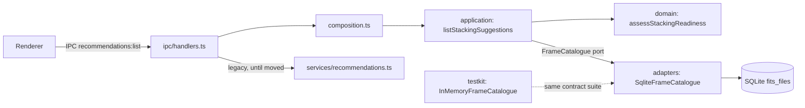

# Hexagonal core and EARS traceability

This is how the app moves to a hexagonal architecture without a rewrite. The existing Electron app
keeps working; logic moves out of `src/main/services` into a core one use case at a time
(the strangler pattern), and each moved piece is reachable through the same IPC channel as before.

## Layout

```text
packages/
  domain/        entities, value objects and rules. Pure: imports only its own files.
  application/   use cases and the ports (interfaces) they need. Imports only @astro/domain.
  testkit/       in-memory adapters, test data builders and port contract suites. Test-only.
src/main/
  adapters/      driven adapters for the desktop app (SQLite today) and presenters for IPC.
  composition.ts composition root: builds use cases from adapters. The only place they meet.
  ipc/           driving adapter: IPC handlers call use cases from the composition root.
  services/      legacy services, shrinking as logic moves into packages/.
```



The packages are folders with path aliases (`@astro/domain`, `@astro/application`, `@astro/testkit`)
wired in `tsconfig.json`, `vitest.config.ts` and `electron.vite.config.ts`, so Vite bundles them into
the main process. They become workspace packages when a second app (the NAS core-api) needs to
consume them; until then a workspace tool would add packaging risk for Electron Forge and
better-sqlite3 without any gain.

## Rules

| Rule | Enforced by |
|---|---|
| Domain imports only its own files; application imports only itself and the domain (NFR-004) | `tests/architecture/hexagon-boundaries.test.ts` |
| Every adapter of a port passes the port's contract suite (NFR-006) | `packages/testkit/src/contracts/*.contract.ts`, run in `tests/contracts/` |
| Core code takes its dependencies as arguments; no `getSqlite()`, no `vi.mock` of modules in core tests | Review; adapters take a `Database` in their constructor |
| Every requirement ID is cited by a test; no test cites an unknown ID (NFR-005, NFR-007) | `npm run ears` in CI |
| Core and adapters keep high coverage | `vitest.config.ts` per-path thresholds |

## Moving a service into the core

1. Add the EARS requirements it satisfies to the slice's `specs/<nnn>/requirements.md`.
2. Put the rules in `packages/domain` as pure functions and test them there, citing the IDs.
3. Put the orchestration in a use case in `packages/application`, with a port for each thing it reads or writes.
4. Add an in-memory adapter to `packages/testkit` and a contract suite for the port.
5. Implement the port in `src/main/adapters` against the existing tables and run the same contract suite on it.
6. Wire it in `src/main/composition.ts` and point the IPC handler at the use case. Delete the old service code.

## EARS

Requirements live in `specs/<nnn>/requirements.md` as a table of ID, pattern and text. The gate
(`scripts/ears/`) reads every such table and every `*.test.ts` and `*.contract.ts` file, and fails
the build on an uncited requirement, an unknown or duplicate ID, or wording that does not match the
declared pattern. A test cites a requirement by putting its ID in square brackets in the test name:

```ts
it('[DSC-010] Given 8 h of subs and no stack, When assessed, Then it is ready to stack', ...)
```

Only requirements a slice is building go into a spec, so the blueprint's full list is a backlog and
the gate never asks for tests of work nobody has started.
