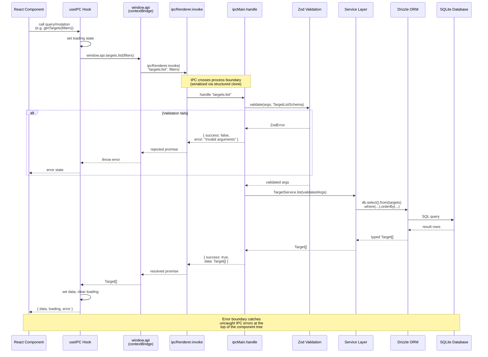

# IPC Communication Flow

All communication between the React renderer and the Node.js main process uses Electron's IPC (Inter-Process Communication) mechanism. The renderer never has direct access to Node.js APIs or the database. Instead, React components call typed wrapper functions exposed on `window.api` by the preload script's `contextBridge`. These wrappers invoke `ipcRenderer.invoke()`, which sends an asynchronous message to the main process. On the main-process side, `ipcMain.handle()` receives the call, validates the arguments against a Zod schema, delegates to the appropriate service method, and returns the result (or a structured error) back through the same channel.

