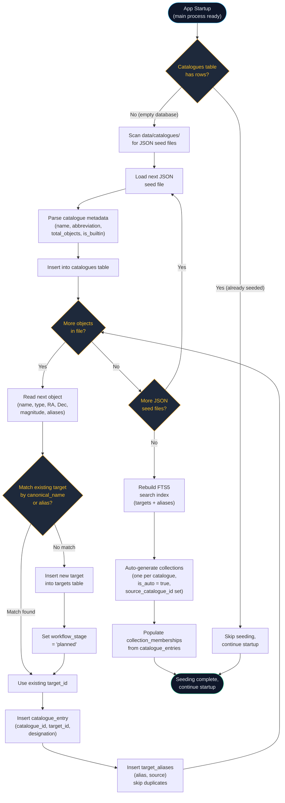

# Seed Data Flow

When the application starts, it checks whether catalogue data has already been loaded into the database. If not (first run, or after a database reset), it reads JSON seed files from the `data/catalogues/` directory and populates the targets, catalogues, catalogue entries, and aliases tables. The loader performs deduplication by matching incoming objects against existing targets by name and known aliases, so re-running the seed process is safe and idempotent. After all catalogue data is loaded, the FTS (full-text search) index is rebuilt and auto-generated collections are created -- one per catalogue -- so users immediately have browsable groupings.

