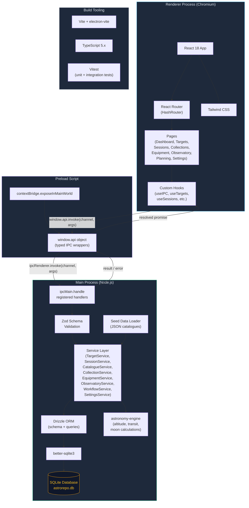

# System Overview

Astrorepo is an Electron desktop application following the standard main/preload/renderer architecture. The **Main Process** owns the SQLite database (via better-sqlite3 and Drizzle ORM), exposes service methods through IPC handlers, and manages native OS integration. The **Preload** script uses Electron's `contextBridge` to expose a type-safe API object to the renderer without granting direct Node.js access. The **Renderer Process** is a React 18 SPA bundled by Vite, using React Router (HashRouter) for navigation and Tailwind CSS for styling. All communication between renderer and main crosses the IPC bridge, with Zod schemas validating every request on the main-process side.

