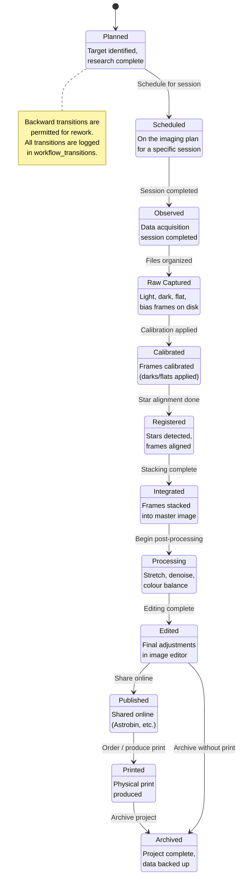

# Workflow State Machine

Every target in Astrorepo moves through a linear workflow that tracks its progress from initial planning through to a finished, archived image. The workflow has 12 stages reflecting the real astrophotography pipeline: planning and scheduling, data capture, calibration and stacking, post-processing, and output. Each transition is recorded in the `workflow_transitions` table with a timestamp and optional notes, providing a full audit trail of a target's journey. While the primary flow is linear, targets can be moved backward (e.g., re-observed after a failed integration) and the state machine allows any transition to support flexible real-world workflows.

